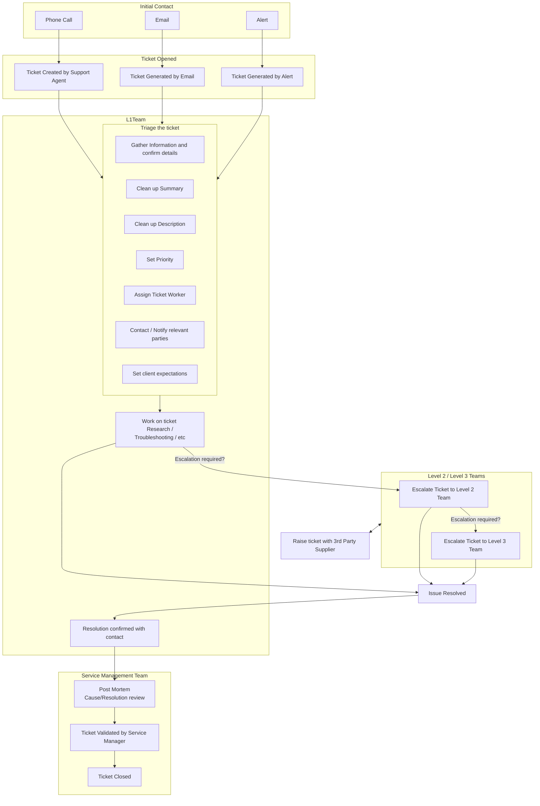

```mermaid

graph TD

subgraph Init[Initial Contact]
    direction LR
    Phone[Phone Call]
    Email
    Alert
end

subgraph TicketOpened[Ticket Opened]
    OpenTicket[Ticket Created by Support Agent]
    TicketGeneratedByEmail[Ticket Generated by Email]
    TicketGeneratedByAlert[Ticket Generated by Alert]
    end

subgraph L1Team
    
    OpenTicket

    subgraph TriageTicket[Triage the ticket]
        direction LR
        GatherInfo[Gather Information and confirm details]
        CleanSummary[Clean up Summary]
        CleanDescription[Clean up Description]
        SetPriority[Set Priority]
        AssignTicket[Assign Ticket Worker]
        Contact[Contact / Notify relevant parties]
        SetExpectations[Set client expectations]
    end

    WorkTicket[Work on ticket <br> Research / Troubleshooting / etc]
    ValidateResolution[Resolution confirmed with contact]
end

subgraph Level23Team[Level 2 / Level 3 Teams]
    EscalateTicketL2[Escalate Ticket to Level 2 Team]
    EscalateTicketL3[Escalate Ticket to Level 3 Team]
end


RaiseWith3rdParty[Raise ticket with 3rd Party Supplier]
IssueResolved[Issue Resolved]


subgraph ServiceManagementTeam[Service Management Team]
    PostMortem[Post Mortem <br> Cause/Resolution review]
    TicketValidation[Ticket Validated by Service Manager]
    TicketClosed[Ticket Closed]
end

Phone --> OpenTicket
OpenTicket --> TriageTicket
TriageTicket --> WorkTicket
WorkTicket --> IssueResolved
IssueResolved --> ValidateResolution
ValidateResolution --> PostMortem
PostMortem --> TicketValidation
TicketValidation --> TicketClosed

WorkTicket --Escalation required?--> EscalateTicketL2
EscalateTicketL2 --Escalation required?--> EscalateTicketL3
EscalateTicketL2 --> IssueResolved
EscalateTicketL3 --> IssueResolved

Level23Team <--> RaiseWith3rdParty

Email --> TicketGeneratedByEmail
TicketGeneratedByEmail --> TriageTicket

Alert --> TicketGeneratedByAlert
TicketGeneratedByAlert --> TriageTicket
```
