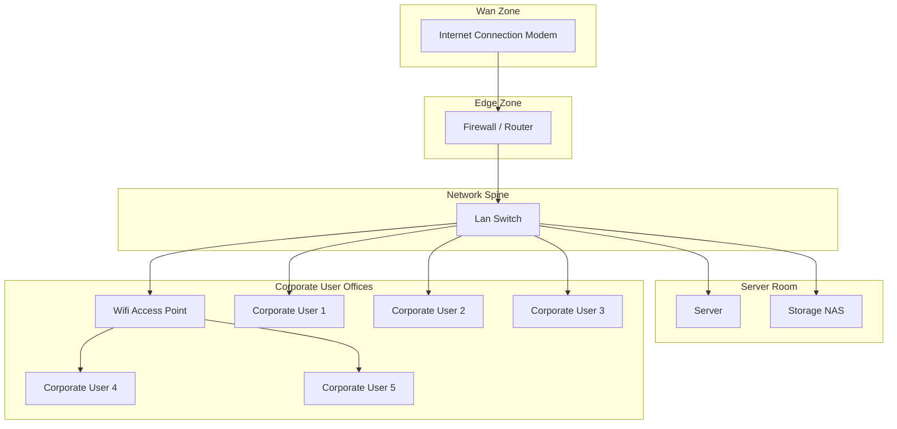
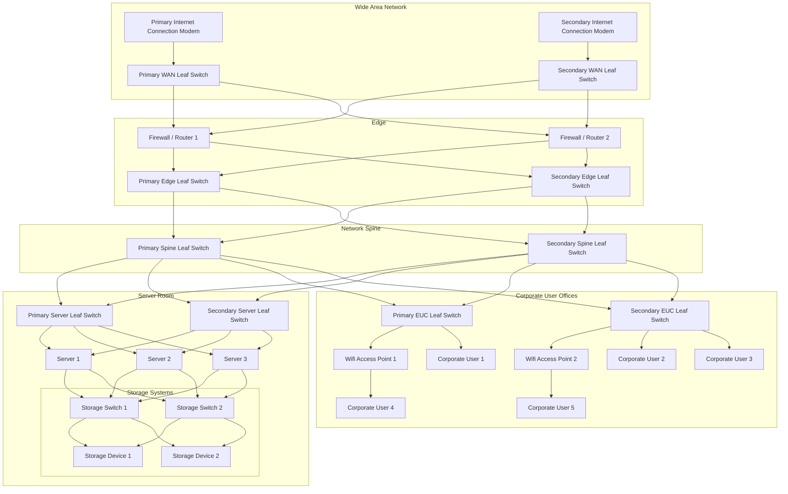

## Basic Design

This is the simplest solution, suitable for small businesses with a single office.

As it has no built in redundancy, it has the risk that the entire network will go down if any single component fails. It is recommended that a contingency plan is in place to handle the risk of a complete network failure

Most noteworthy is that there will be a requirement for managed outages when network systems require a reboot for maintenance, updates or other reasons.

## An example High Availability Design

We are making the following assumptions to facilitate a high-availability setup.

- There are two separate and independent internet connections
- Each internet connection provides at least 2 IP addresses, one for each firewall

The below setup is suitable for most small to medium businesses where the cost of downtime is higher.

Redundant Internet connections mean that in most cases when a single internet connection fails, the business will still be able to operate.

The next layer of redundancy is the Firewall/Router - a firewall requires periodic reboots to install updates, and having a pair in a high-availability setup means that the network will continue to operate even when one firewall is rebooting.

Next is our LAN switches. A bad configuration change to one may cause a switch to stop handling network traffic correctly, so having a secondary switch means the network is likely to still function.

It's rare for switches to fail, but it does happen.

Finally, we have our servers, which in this example are clustered with a shared storage device. If a single server needs to reboot for updates, the services it operates can be migrated to another server in the cluster, and the server can be rebooted without any business-facing downtime.

For the sake of simplicity, we have not included a backup solution in this diagram, nor any replication links between like-for-like devices, however it is highly recommended that a backup solution is implemented.

It's clear from the diagram below that a high availability configuration introduces a lot of additional complexity and cost, however the benefits are worth it for most businesses. Typically High Availability is implemented in line with the business' risk vectors, appetite, and availability targets.

