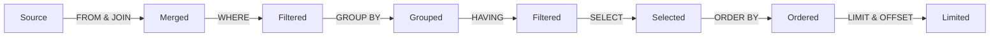

In SQL, the order in which query statements are executed generally follows a logical sequence called the "query processing order." While the specific execution order can vary depending on the database management system (DBMS) and query optimization, a general overview is as follows:



1. FROM clause: The first step is to identify the tables or data sources involved in the query. This is specified in the FROM clause, where you specify the tables from which you want to retrieve data.
2. JOIN clause: If your query involves joining multiple tables, the JOIN operations are executed based on the specified join conditions.
3. ON clause: If your join is on a particular index, this is executed next.
4. WHERE clause: After identifying the tables, the WHERE clause is used to filter the rows based on specified conditions. Rows that do not meet the conditions are excluded from further processing.
5. GROUP BY clause: If the query includes a GROUP BY clause, rows are grouped together based on the specified columns. This is typically used with aggregate functions like SUM, COUNT, AVG, etc., to perform calculations on grouped data.
6. HAVING clause: If there is a GROUP BY clause, the HAVING clause is used to filter the grouped results based on specified conditions, similar to the WHERE clause but applied after grouping.
7. SELECT clause: After filtering and grouping, the SELECT clause specifies which columns or expressions you want to retrieve in the final result set. Aggregates and calculations on grouped data may also be included in the SELECT clause.
8. ORDER BY clause: If the query includes an ORDER BY clause, the result set is sorted based on the specified column(s) and sorting order.
9. LIMIT/OFFSET (or equivalent): If you want to limit the number of rows returned or implement pagination, you can use the LIMIT (or equivalent) clause to restrict the result set.
10. UNION/INTERSECT/EXCEPT (if applicable): If your query involves combining the results of multiple queries using UNION, INTERSECT, or EXCEPT, this step occurs after the individual query processing.
11. Subqueries (if applicable): Subqueries are executed within the context of the main query, typically from the innermost to the outermost subquery.

It's important to note that modern DBMSs often employ query optimization techniques to rearrange and optimize the execution plan for better performance. This may result in the actual execution order being different from the order specified in the SQL query. The database optimizer's goal is to choose the most efficient way to retrieve and process data while minimizing resource usage.

So, while the logical order described above provides a general understanding of how SQL queries are processed, the actual execution plan may be optimized by the DBMS to improve query performance.

Following the order specified in the above steps, the query:

```sql
SELECT customer_id, COUNT(order_id_ as total_orders), SUM(order_amount) as total_spent
FROM customers
JOIN orders
ON customers.id = orders.customer_id
WHERE ORDER_DATE >= '2022-12-31'
GROUP BY customer_id
HAVING total_spent >= 1000
ORDER BY total_spent DESC
LIMIT 10;
```

results in an execution order show below.


For a more detailed explainer, this [video](https://www.youtube.com/watch?v=BHwzDmr6d7s) by ByteByteGo offers an excellent lesson.

<iframe width="1280" height="720" src="https://www.youtube.com/embed/BHwzDmr6d7s" title="Secret To Optimizing SQL Queries - Understand The SQL Execution Order" frameborder="0" allow="accelerometer; autoplay; clipboard-write; encrypted-media; gyroscope; picture-in-picture; web-share" allowfullscreen></iframe>
