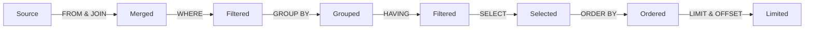

SQL Queries execute in the following order

```mermaid

graph LR

Source
Merged
Filtered1[Filtered]
Grouped
Filtered2[Filtered]
Selected
Ordered
Limited

Source --FROM & JOIN--> Merged
Merged --WHERE--> Filtered1
Filtered1 --GROUP BY--> Grouped
Grouped --HAVING--> Filtered2
Filtered2 --SELECT--> Selected
Selected --ORDER BY--> Ordered
Ordered --LIMIT & OFFSET--> Limited

```

Resulting in a query execution order as follows

