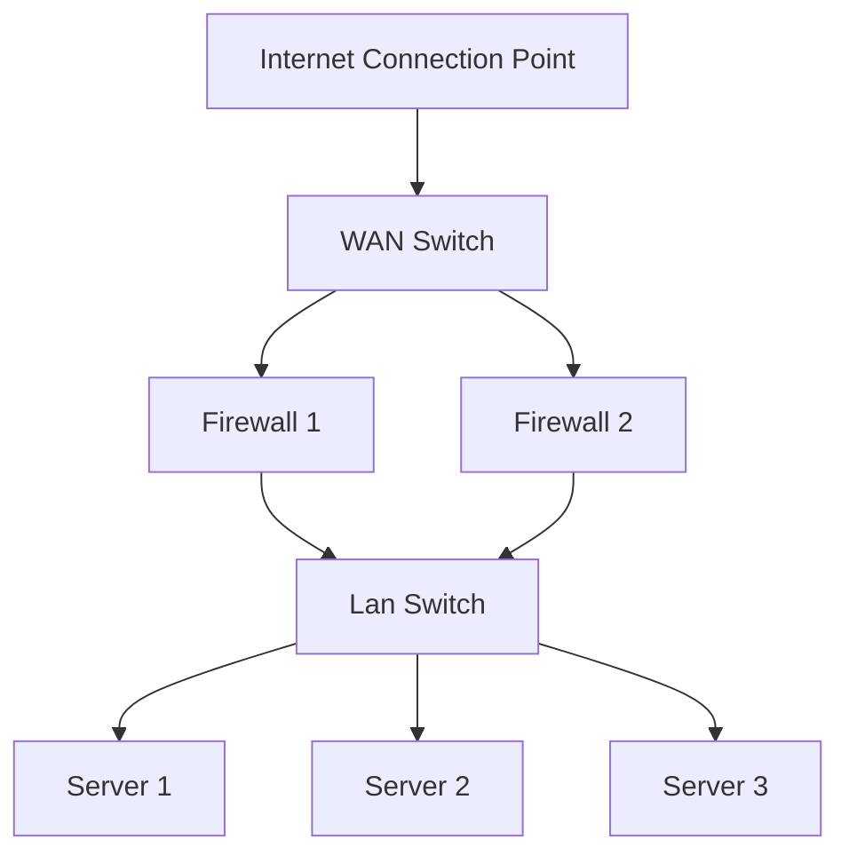

```mermaid

graph TD

Internet[Internet Connection Point]
WanSwitch[WAN Switch]
Firewall1[Firewall 1]
Firewall2[Firewall 2]
LanSwitch[Lan Switch]
Server1[Server 1]
Server2[Server 2]
Server3[Server 3]

Internet --> WanSwitch
WanSwitch --> Firewall1
WanSwitch --> Firewall2
Firewall1 --> LanSwitch
Firewall2 --> LanSwitch
LanSwitch --> Server1
LanSwitch --> Server2
LanSwitch --> Server3
```
